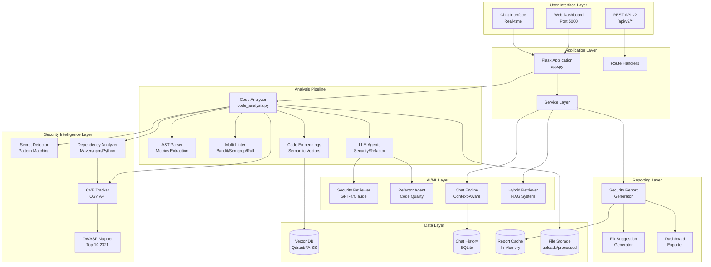
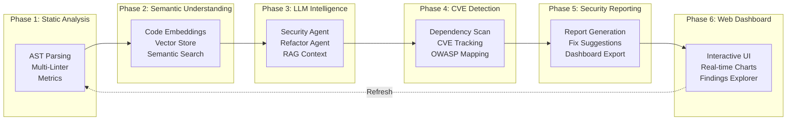

# 🔍 AI-Powered Code Review Platform

An intelligent, enterprise-grade AI code analysis platform that combines multi-layered static analysis, machine learning, and specialized LLM agents to provide comprehensive security reviews, code quality assessments, and interactive code discussions.

[](https://www.python.org/downloads/)
[](https://flask.palletsprojects.com/)
[](https://www.docker.com/)
[](LICENSE)

---

## ✨ Key Features

### 🔐 Security Analysis

- **Multi-layered Static Analysis**: Integrated with **Bandit**, **Semgrep**, and **Ruff**.
- **CVE Detection**: Automatic vulnerability scanning for dependencies using the **OSV database**.
- **Secret Detection**: Regex and entropy-based identification of hardcoded credentials/API keys.
- **OWASP Top 10 Mapping**: Every finding is categorized by **OWASP 2021** standards.

### 🤖 AI Intelligence

- **LLM Specialized Agents**: Context-aware agents for **Security Review** and **Code Refactoring**.
- **Multi-Provider Support**: Compatible with **OpenAI**, **Anthropic**, **Mistral**, and **Gemini**.
- **Interactive Chat**: Conversational AI interface for discussing code security with context.
- **RAG-Enhanced Retrieval**: Retrieval-Augmented Generation using **Qdrant** for high-accuracy answers.

### 🔍 Code Quality & Insights

- **AST Metrics**: extraction of cyclomatic complexity, maintainability index, and LOC.
- **Automated Refactoring**: AI-generated suggestions for design pattern improvements and code cleanup.
- **Semantic Code Search**: Find similar code patterns using vector-based similarity search.

---

## 🏗️ Architecture Breakdown

### High-Level System Architecture

The platform follows a modular, 6-phase hybrid architecture that integrates traditional static analysis with modern AI/ML layers.



### 6-Phase Integration Pipeline



### Key Components

#### Backend Core

- **`app.py`**: Main Flask application with routes and middleware
- **`code_analysis.py`**: Orchestrates the entire analysis pipeline
- **`config.py`**: Centralized configuration management

#### Analysis Pipeline

- **Static Analysis**: AST parsing, linting (Bandit, Semgrep, Ruff)
- **CVE Detection**: Dependency scanning via OSV database
- **Secret Detection**: Regex and entropy-based credential detection
- **LLM Analysis**: AI-powered security review and refactoring

#### AI/ML Components

- **Chat Engine**: Context-aware conversational AI
- **LLM Agents**: Specialized agents for different tasks
- **Vector Store**: Qdrant-based semantic code search
- **RAG System**: Retrieval-Augmented Generation for accurate responses

#### Reporting

- **Meta Reasoner**: Aggregates findings from multiple sources
- **Report Generator**: Creates JSON and Markdown reports
- **Dashboard Exporter**: Formats data for UI visualization
- **Fix Generator**: Provides actionable remediation steps

---

## 🛠️ Technology Stack

### Backend & Frameworks

| Category     | Technology                                |
| :----------- | :---------------------------------------- |
| **Core**     | Python 3.9+, Flask 3.0.0                  |
| **WSGI**     | Gunicorn (Production)                     |
| **Database** | SQLite (Auth/Chat), Qdrant (Vector Store) |

### Static Analysis Tools

| Tool        | Purpose                                 |
| :---------- | :-------------------------------------- |
| **Bandit**  | Python security vulnerability detection |
| **Semgrep** | Multi-language pattern-based analysis   |
| **Ruff**    | Ultra-fast Python linter (Rust)         |
| **Radon**   | Code complexity and cyclomatic metrics  |

### AI & Machine Learning

| Component         | Technology                                            |
| :---------------- | :---------------------------------------------------- |
| **LLM Providers** | OpenAI (GPT-4), Anthropic (Claude 3), Google (Gemini) |
| **Embeddings**    | Sentence-Transformers (Local), OpenAI Embeddings      |
| **Vector DB**     | Qdrant, FAISS                                         |
| **RAG**           | Hybrid Retrieval (Vector + Keyword)                   |

---

## 🔒 Security Features

### Multi-Layer Security Analysis

1. **Static Analysis**
   - Bandit: Python-specific security issues
   - Semgrep: Pattern-based vulnerability detection
   - Ruff: Fast Python linter with security rules

2. **Dependency Scanning**
   - OSV database integration
   - Real-time CVE lookups
   - Version-specific vulnerability matching

3. **Secret Detection**
   - Regex-based pattern matching
   - Entropy analysis for random strings
   - Context-aware false positive reduction

4. **LLM-Powered Review**
   - Deep semantic analysis
   - Context-aware vulnerability detection
   - Business logic flaw identification

### OWASP Top 10 Coverage

All findings are mapped to OWASP categories:

| Category                                    | Detection Method           |
| :------------------------------------------ | :------------------------- |
| **A01: Broken Access Control**              | Semgrep, LLM Agent         |
| **A02: Cryptographic Failures**             | Secret Detector, Bandit    |
| **A03: Injection**                          | Bandit, Semgrep, LLM Agent |
| **A04: Insecure Design**                    | LLM Agent                  |
| **A05: Security Misconfiguration**          | Semgrep, LLM Agent         |
| **A06: Vulnerable Components**              | CVE Tracker, OSV database  |
| **A07: Identification & Auth Failures**     | Semgrep, LLM Agent         |
| **A08: Software & Data Integrity Failures** | Dependency Analysis        |
| **A09: Logging & Monitoring Failures**      | LLM Agent                  |
| **A10: Server-Side Request Forgery**        | Semgrep, LLM Agent         |

---

## 📁 Project Structure

```
ai_code_review/
├── backend/
│   ├── api/                      # REST API Endpoints (v2, file issues)
│   ├── auth/                     # GitHub OAuth & user management
│   ├── embeddings/               # Semantic vectors & Qdrant logic
│   ├── llm_agents/               # Core AI logic (Chat, Security Reviewer)
│   ├── security/                 # CVE tracker, secret detector, OWASP mapper
│   ├── static_analysis/          # AST parsing & multi-linter orchestrator
│   ├── query/                    # RAG retrieval system
│   ├── reporting/                # Fix generator & dashboard exporter
│   └── app.py                    # Main Flask entry point
├── frontend/
│   ├── static/                   # Modern UI assets (CSS/JS)
│   └── templates/                # HTML5 templates (Dashboard, Chat)
├── docs/                         # Detailed technical documentation
└── docker-compose.yml            # Containerized orchestration
```

---

## 🚀 Quick Start

### 1. Prerequisites

- Python 3.9+
- Docker & Docker Compose (for Qdrant)

### 2. Installation

```bash
git clone https://github.com/Krushna56/ai_code_review.git
cd ai_code_review
pip install -r backend/requirements.txt
```

### 3. Configuration

Copy `.env.example` to `.env` and configure your API keys:

```bash
cp backend/.env.example backend/.env
# Edit backend/.env and add your OPENAI_API_KEY or ANTHROPIC_API_KEY
```

### 4. Run the Application

```bash
# Start Qdrant first (Recommended)
docker-compose up -d qdrant

# Launch the Flask server
python backend/app.py
```

Open `http://localhost:5000` to start your first analysis.

---

## 📚 Documentation & Guides

- 🐳 **[Docker Deployment Guide](docs/README_DOCKER.md)**
- 🔑 **[Authentication Setup](docs/AUTHENTICATION_SETUP.md)**
- 🏗️ **[Deep Architecture Dive](docs/README_ARCHITECTURE.md)**

---

## 🤝 Contributing

We welcome contributions! Please follow these steps:

1. Fork the repository
2. Create a feature branch (`git checkout -b feature/amazing-feature`)
3. Commit your changes (`git commit -m 'Add amazing feature'`)
4. Push to the branch (`git push origin feature/amazing-feature`)
5. Open a Pull Request

### Development Guidelines

- Follow PEP 8 style guide for Python code
- Add unit tests for new features
- Update documentation for API changes
- Ensure all tests pass before submitting PR

---

## 🙏 Acknowledgments

- **OpenAI** for GPT models
- **Anthropic** for Claude
- **Mistral AI** for Mistral models
- **Google** for Gemini
- **Qdrant** for vector database
- **Semgrep** for static analysis
- **OSV** for vulnerability database

---

## 📞 Support

For issues, questions, or contributions:

- 🐛 [Report a Bug](https://github.com/Krushna56/ai_code_review/issues)
- 💡 [Request a Feature](https://github.com/Krushna56/ai_code_review/issues)
- 📧 Email: krushanakumbhar314@gmail.com

---

## 📄 License

This project is licensed under the MIT License - see the [LICENSE](LICENSE) file for details.
