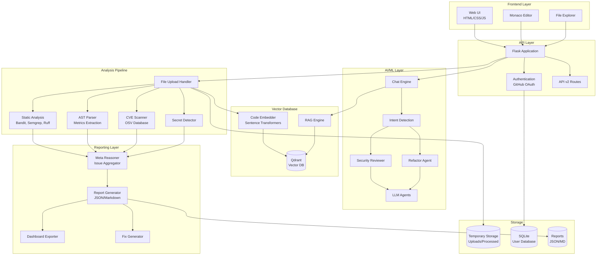
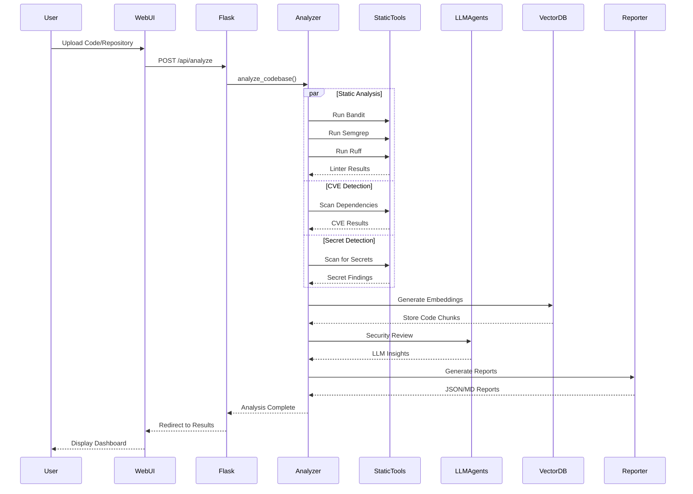
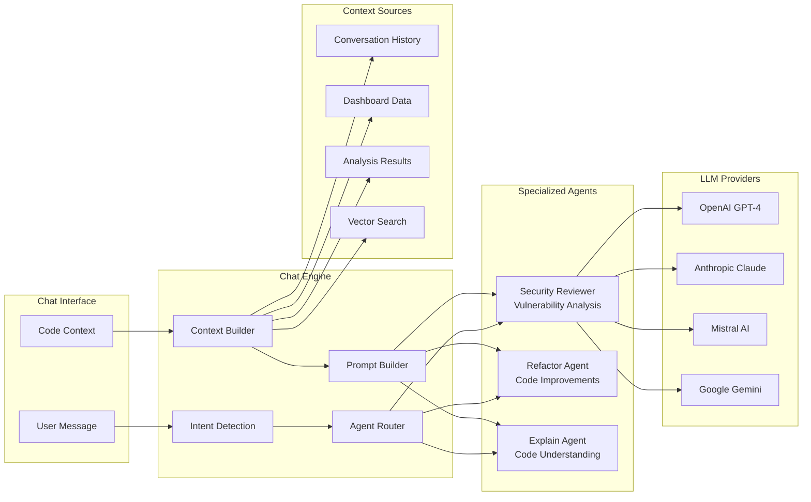
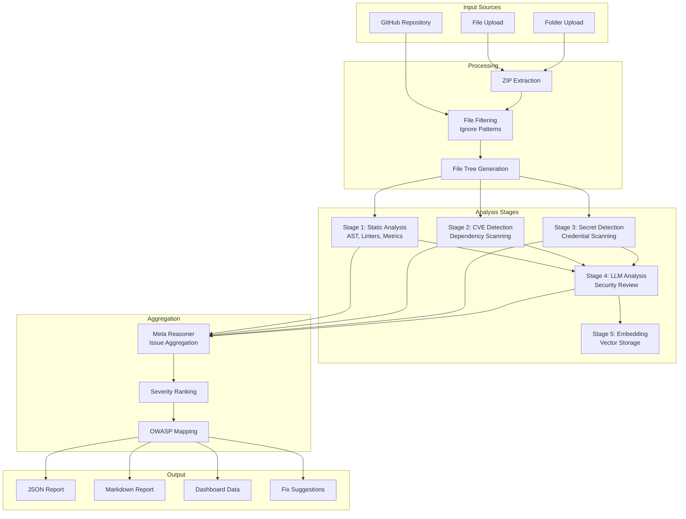

# 🔍 AI Code Review Platform

An intelligent, AI-powered code analysis platform that combines static analysis, machine learning, and LLM-based agents to provide comprehensive security reviews, code quality assessments, and interactive code discussions.

[](https://www.python.org/downloads/)
[](https://flask.palletsprojects.com/)
[](https://www.docker.com/)
[](LICENSE)

---

## 📋 Table of Contents

- [Overview](#-overview)
- [Key Features](#-key-features)
- [Architecture](#-architecture)
- [Technology Stack](#-technology-stack)
- [Installation](#-installation)
- [Configuration](#-configuration)
- [Usage](#-usage)
- [API Documentation](#-api-documentation)
- [Project Structure](#-project-structure)
- [Contributing](#-contributing)

---

## 🌟 Overview

The AI Code Review Platform is a comprehensive security and code quality analysis tool that leverages cutting-edge AI technologies to provide:

- **Multi-layered Security Analysis**: Combines static analysis tools (Bandit, Semgrep, Ruff) with LLM-powered security reviews
- **CVE Detection**: Automatic dependency vulnerability scanning using OSV database
- **Secret Detection**: Identifies hardcoded credentials, API keys, and sensitive data
- **Interactive AI Chat**: Conversational interface for code discussions with context awareness
- **Vector-based Semantic Search**: Qdrant-powered code search using embeddings
- **Comprehensive Reporting**: Detailed security reports with OWASP mapping and fix suggestions

---

## ✨ Key Features

### 🔐 Security Analysis

- **Static Analysis**: Bandit, Semgrep, Ruff, and Pylint integration
- **CVE Detection**: Automated vulnerability scanning for dependencies
- **Secret Detection**: Identifies hardcoded credentials and API keys
- **OWASP Mapping**: Maps findings to OWASP Top 10 categories
- **CWE Classification**: Common Weakness Enumeration tagging

### 🤖 AI-Powered Intelligence

- **LLM Agents**: Specialized agents for security review and refactoring
- **Multi-Provider Support**: OpenAI, Anthropic, Mistral, and Gemini
- **Intelligent Chat**: Context-aware conversational AI for code discussions
- **Intent Detection**: Automatic routing to specialized agents

### 🔍 Code Analysis

- **AST Parsing**: Deep code structure analysis
- **Complexity Metrics**: Cyclomatic complexity, maintainability index
- **Code Formatting**: Automated PEP8 compliance with autopep8
- **Multi-Language Support**: Python, JavaScript, Java, Go, C++, and more

### 💾 Vector Database

- **Qdrant Integration**: High-performance vector storage
- **Semantic Search**: Find similar code patterns
- **Code Embeddings**: Sentence transformers and OpenAI embeddings
- **RAG Pipeline**: Retrieval-Augmented Generation for context-aware responses

### 🎨 Modern UI

- **VS Code-Style Interface**: Monaco editor integration
- **File Explorer**: Interactive project navigation
- **Real-time Analysis**: Live progress tracking
- **Dashboard**: Visual security metrics and trends

### 🔑 Authentication

- **GitHub OAuth**: Secure authentication via GitHub
- **Session Management**: Flask-Login integration
- **User Management**: SQLite-based user database

---

## 🏗️ Architecture

### High-Level Architecture



### Analysis Pipeline Flow



### Chat Engine Architecture



### Data Flow Architecture



---

## 🛠️ Technology Stack

### Backend

- **Framework**: Flask 3.0.0
- **Language**: Python 3.9+
- **Authentication**: Flask-Login, GitHub OAuth
- **Database**: SQLite (User Management)

### AI/ML

- **LLM Providers**: OpenAI, Anthropic, Mistral, Google Gemini
- **Embeddings**: Sentence Transformers, OpenAI Embeddings
- **Vector Database**: Qdrant
- **ML Frameworks**: scikit-learn, XGBoost, PyTorch, Transformers

### Static Analysis

- **Security**: Bandit, Semgrep
- **Code Quality**: Ruff, Pylint, Radon
- **Formatting**: autopep8
- **Secret Detection**: detect-secrets

### Frontend

- **Editor**: Monaco Editor (VS Code)
- **UI**: HTML5, CSS3, JavaScript
- **Icons**: Font Awesome
- **Styling**: Custom CSS with modern design

### Infrastructure

- **Containerization**: Docker, Docker Compose
- **Vector DB**: Qdrant (containerized)
- **Storage**: Temporary file system storage

---

## 📦 Installation

### Prerequisites

- Python 3.9 or higher
- Docker and Docker Compose (for containerized deployment)
- Git

### Option 1: Docker Deployment (Recommended)

1. **Clone the repository**

```bash
git clone https://github.com/yourusername/ai_code_review.git
cd ai_code_review
```

2. **Configure environment variables**

```bash
cp backend/.env.example backend/.env
# Edit backend/.env with your API keys
```

3. **Start the application**

```bash
docker-compose up -d
```

4. **Access the application**

- Web UI: http://localhost:5000
- Qdrant Dashboard: http://localhost:6333/dashboard

### Option 2: Local Development

1. **Clone the repository**

```bash
git clone https://github.com/yourusername/ai_code_review.git
cd ai_code_review
```

2. **Create virtual environment**

```bash
python -m venv venv
source venv/bin/activate  # On Windows: venv\Scripts\activate
```

3. **Install dependencies**

```bash
cd backend
pip install -r requirements.txt
```

4. **Configure environment**

```bash
cp .env.example .env
# Edit .env with your configuration
```

5. **Run Qdrant (required for vector search)**

```bash
docker run -p 6333:6333 qdrant/qdrant:latest
```

6. **Start the application**

```bash
python run.py
```

---

## ⚙️ Configuration

### Environment Variables

Create a `.env` file in the `backend` directory:

```env
# Flask Configuration
SECRET_KEY=your-secret-key-here
FLASK_ENV=development

# LLM Configuration
OPENAI_API_KEY=sk-...
ANTHROPIC_API_KEY=sk-ant-...
MISTRAL_API_KEY=...
GEMINI_API_KEY=...

# LLM Provider Selection
CHAT_PROVIDER=gemini          # For chat interface
ANALYSIS_PROVIDER=mistral     # For code analysis
ANALYSIS_FALLBACK_PROVIDER=anthropic

# Embedding Configuration
EMBEDDING_PROVIDER=local      # Options: local, openai, codestral
LOCAL_EMBEDDING_MODEL=all-MiniLM-L6-v2

# Vector Database
VECTOR_DB_TYPE=qdrant
QDRANT_HOST=localhost
QDRANT_PORT=6333
QDRANT_COLLECTION=code_chunks

# Feature Flags
ENABLE_ML_ANALYSIS=true
ENABLE_LLM_AGENTS=true
ENABLE_SEMANTIC_SEARCH=true
ENABLE_CVE_DETECTION=true
ENABLE_SECURITY_REPORTING=true

# Static Analysis Tools
ENABLE_BANDIT=true
ENABLE_SEMGREP=true
ENABLE_RUFF=true
ENABLE_PYLINT=false

# GitHub OAuth (Optional)
GITHUB_CLIENT_ID=your-github-client-id
GITHUB_CLIENT_SECRET=your-github-client-secret

# Performance
MAX_WORKERS=4
CACHE_EMBEDDINGS=true
MAX_CONTENT_LENGTH=21474836480  # 20GB

# Temporary File Cleanup
TEMP_FILE_RETENTION_HOURS=24
```

### Feature Flags

| Flag                        | Description                              | Default |
| --------------------------- | ---------------------------------------- | ------- |
| `ENABLE_ML_ANALYSIS`        | Enable machine learning-based analysis   | `true`  |
| `ENABLE_LLM_AGENTS`         | Enable LLM-powered security agents       | `true`  |
| `ENABLE_SEMANTIC_SEARCH`    | Enable vector-based code search          | `true`  |
| `ENABLE_CVE_DETECTION`      | Enable dependency vulnerability scanning | `true`  |
| `ENABLE_SECURITY_REPORTING` | Enable comprehensive security reports    | `true`  |
| `ENABLE_BANDIT`             | Enable Bandit security scanner           | `true`  |
| `ENABLE_SEMGREP`            | Enable Semgrep static analysis           | `true`  |
| `ENABLE_RUFF`               | Enable Ruff linter                       | `true`  |
| `ENABLE_PYLINT`             | Enable Pylint analysis                   | `false` |

---

## 🚀 Usage

### Web Interface

1. **Upload Code**
   - Navigate to http://localhost:5000
   - Upload a ZIP file, folder, or paste a GitHub repository URL
   - Click "Analyze Code"

2. **View Results**
   - Processing page shows real-time analysis progress
   - Dashboard displays security metrics and findings
   - Interactive file explorer for code navigation

3. **Interactive Chat**
   - Click "Chat" to open the AI assistant
   - Ask questions about security issues
   - Request code explanations or refactoring suggestions
   - Chat maintains context of your analysis

### API Usage

#### Analyze Code

```bash
curl -X POST http://localhost:5000/api/analyze \
  -F "codebase=@your-code.zip"
```

#### Analyze GitHub Repository

```bash
curl -X POST http://localhost:5000/api/analyze/repo \
  -H "Content-Type: application/json" \
  -d '{"repo_url": "https://github.com/user/repo"}'
```

#### Chat with AI

```bash
curl -X POST http://localhost:5000/api/v2/chat/message \
  -H "Content-Type: application/json" \
  -d '{
    "session_id": "your-session-id",
    "message": "What are the critical security issues?",
    "stream": false
  }'
```

### CLI Usage

```bash
# Analyze a directory
python backend/cli.py analyze /path/to/code --output /path/to/output

# Query the codebase
python backend/cli.py query "Find SQL injection vulnerabilities"

# Export report
python backend/cli.py export --format markdown --output report.md
```

---

## 📚 API Documentation

### Authentication Endpoints

| Endpoint                | Method   | Description             |
| ----------------------- | -------- | ----------------------- |
| `/auth/login`           | GET/POST | User login page         |
| `/auth/register`        | GET/POST | User registration       |
| `/auth/logout`          | GET      | User logout             |
| `/auth/github`          | GET      | GitHub OAuth initiation |
| `/auth/github/callback` | GET      | GitHub OAuth callback   |

### Analysis Endpoints

| Endpoint                     | Method | Description                    |
| ---------------------------- | ------ | ------------------------------ |
| `/`                          | POST   | Upload and analyze code        |
| `/api/analyze`               | POST   | API endpoint for code analysis |
| `/api/analyze/repo`          | POST   | Analyze GitHub repository      |
| `/api/analysis/status/<uid>` | GET    | Check analysis status          |
| `/processing?uid=<uid>`      | GET    | Processing page with progress  |

### File & Code Endpoints

| Endpoint                         | Method | Description                |
| -------------------------------- | ------ | -------------------------- |
| `/api/files/<uid>`               | GET    | Get file tree structure    |
| `/api/file/content/<uid>/<path>` | GET    | Get file content           |
| `/chat?uid=<uid>`                | GET    | Interactive chat interface |

### Chat API v2

| Endpoint                            | Method | Description              |
| ----------------------------------- | ------ | ------------------------ |
| `/api/v2/chat/session`              | POST   | Create new chat session  |
| `/api/v2/chat/message`              | POST   | Send message to AI       |
| `/api/v2/chat/history/<session_id>` | GET    | Get conversation history |
| `/api/v2/chat/session/<session_id>` | DELETE | End chat session         |

### Report Endpoints

| Endpoint                           | Method | Description                |
| ---------------------------------- | ------ | -------------------------- |
| `/download/<uid>/<filename>`       | GET    | Download generated reports |
| `/api/v2/file-issues/<uid>/<path>` | GET    | Get file-specific issues   |

---

## 📁 Project Structure

```
ai_code_review/
├── backend/
│   ├── api/                      # API routes
│   │   ├── v2_routes.py         # Chat and analysis API v2
│   │   └── file_issues.py       # File-specific issue endpoints
│   ├── auth/                     # Authentication module
│   │   ├── routes.py            # Login, register, OAuth
│   │   └── forms.py             # WTForms for auth
│   ├── embeddings/               # Vector embeddings
│   │   ├── code_embedder.py     # Code embedding generation
│   │   ├── qdrant_store.py      # Qdrant vector store
│   │   └── vector_store.py      # Abstract vector store
│   ├── llm_agents/               # AI agents
│   │   ├── chat_engine.py       # Conversational AI engine
│   │   ├── security_reviewer.py # Security analysis agent
│   │   ├── refactor_agent.py    # Refactoring agent
│   │   └── base_agent.py        # Base agent class
│   ├── meta_reasoner/            # Analysis aggregation
│   │   ├── issue_aggregator.py  # Combine findings
│   │   ├── severity_ranker.py   # Risk scoring
│   │   └── report_generator.py  # Report synthesis
│   ├── models/                   # Data models
│   │   └── user.py              # User authentication model
│   ├── parsers/                  # Code parsing
│   │   ├── code_chunker.py      # Code segmentation
│   │   └── java_parser.py       # Multi-language parsing
│   ├── query/                    # RAG system
│   │   ├── retrieval_engine.py  # Vector search
│   │   ├── query_handler.py     # Query processing
│   │   └── rag_prompts.py       # Prompt templates
│   ├── reporting/                # Report generation
│   │   ├── security_report_generator.py
│   │   ├── fix_generator.py     # Fix suggestions
│   │   └── dashboard_exporter.py
│   ├── security/                 # Security analysis
│   │   ├── cve_tracker.py       # CVE detection
│   │   ├── dependency_analyzer.py
│   │   ├── secret_detector.py   # Credential scanning
│   │   ├── owasp_mapper.py      # OWASP categorization
│   │   └── security_aggregator.py
│   ├── services/                 # Business logic
│   │   ├── conversation_manager.py
│   │   ├── report_service.py
│   │   ├── feedback_service.py
│   │   └── ai_code_detector.py
│   ├── static_analysis/          # Static analysis tools
│   │   ├── ast_parser.py        # AST metrics
│   │   └── multi_linter.py      # Linter orchestration
│   ├── utils/                    # Utilities
│   │   └── file_filter.py       # File filtering logic
│   ├── app.py                    # Flask application
│   ├── code_analysis.py          # Main analysis pipeline
│   ├── config.py                 # Configuration
│   ├── requirements.txt          # Python dependencies
│   └── Dockerfile                # Container definition
├── frontend/
│   ├── static/                   # Static assets
│   │   ├── css/                 # Stylesheets
│   │   ├── js/                  # JavaScript
│   │   └── images/              # Images
│   └── templates/                # HTML templates
│       ├── index.html           # Upload page
│       ├── chat.html            # Chat interface
│       ├── processing.html      # Analysis progress
│       ├── dashboard.html       # Results dashboard
│       └── auth/                # Auth templates
├── docker-compose.yml            # Docker orchestration
├── .env.example                  # Environment template
└── README.md                     # This file
```

### Key Components

#### Backend Core

- **`app.py`**: Main Flask application with routes and middleware
- **`code_analysis.py`**: Orchestrates the entire analysis pipeline
- **`config.py`**: Centralized configuration management

#### Analysis Pipeline

- **Static Analysis**: AST parsing, linting (Bandit, Semgrep, Ruff)
- **CVE Detection**: Dependency scanning via OSV database
- **Secret Detection**: Regex and entropy-based credential detection
- **LLM Analysis**: AI-powered security review and refactoring

#### AI/ML Components

- **Chat Engine**: Context-aware conversational AI
- **LLM Agents**: Specialized agents for different tasks
- **Vector Store**: Qdrant-based semantic code search
- **RAG System**: Retrieval-Augmented Generation for accurate responses

#### Reporting

- **Meta Reasoner**: Aggregates findings from multiple sources
- **Report Generator**: Creates JSON and Markdown reports
- **Dashboard Exporter**: Formats data for UI visualization
- **Fix Generator**: Provides actionable remediation steps

---

## 🔒 Security Features

### Multi-Layer Security Analysis

1. **Static Analysis**
   - Bandit: Python-specific security issues
   - Semgrep: Pattern-based vulnerability detection
   - Ruff: Fast Python linter with security rules

2. **Dependency Scanning**
   - OSV database integration
   - Real-time CVE lookups
   - Version-specific vulnerability matching

3. **Secret Detection**
   - Regex-based pattern matching
   - Entropy analysis for random strings
   - Context-aware false positive reduction

4. **LLM-Powered Review**
   - Deep semantic analysis
   - Context-aware vulnerability detection
   - Business logic flaw identification

### OWASP Top 10 Mapping

All findings are mapped to OWASP categories:

- A01:2021 - Broken Access Control
- A02:2021 - Cryptographic Failures
- A03:2021 - Injection
- A04:2021 - Insecure Design
- A05:2021 - Security Misconfiguration
- A06:2021 - Vulnerable and Outdated Components
- A07:2021 - Identification and Authentication Failures
- A08:2021 - Software and Data Integrity Failures
- A09:2021 - Security Logging and Monitoring Failures
- A10:2021 - Server-Side Request Forgery

---

## 🤝 Contributing

We welcome contributions! Please follow these steps:

1. Fork the repository
2. Create a feature branch (`git checkout -b feature/amazing-feature`)
3. Commit your changes (`git commit -m 'Add amazing feature'`)
4. Push to the branch (`git push origin feature/amazing-feature`)
5. Open a Pull Request

### Development Guidelines

- Follow PEP 8 style guide for Python code
- Add unit tests for new features
- Update documentation for API changes
- Ensure all tests pass before submitting PR

---

## 📄 License

This project is licensed under the MIT License - see the [LICENSE](LICENSE) file for details.

---

## 🙏 Acknowledgments

- **OpenAI** for GPT models
- **Anthropic** for Claude
- **Mistral AI** for Mistral models
- **Google** for Gemini
- **Qdrant** for vector database
- **Semgrep** for static analysis
- **OSV** for vulnerability database

---

## 📞 Support

For issues, questions, or contributions:

- 🐛 [Report a Bug](https://github.com/yourusername/ai_code_review/issues)
- 💡 [Request a Feature](https://github.com/yourusername/ai_code_review/issues)
- 📧 Email: krushanakumbhar314@gmail.com

---
