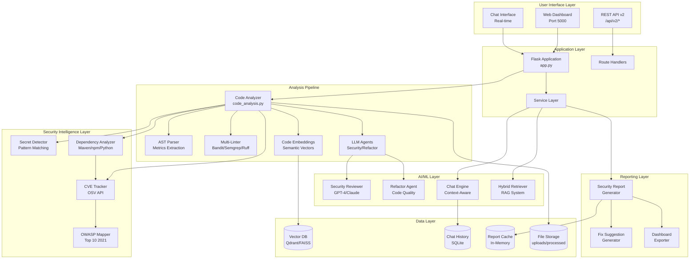
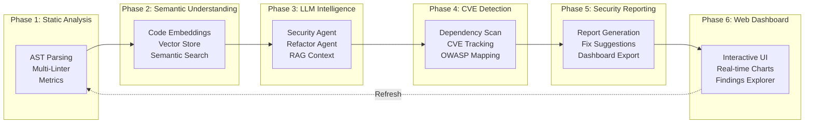
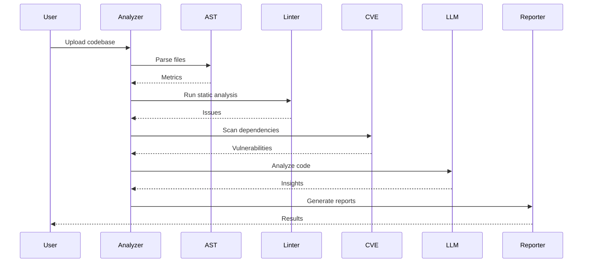
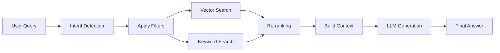
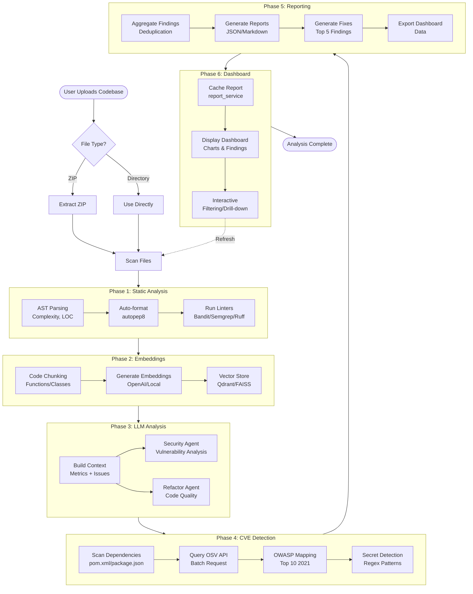
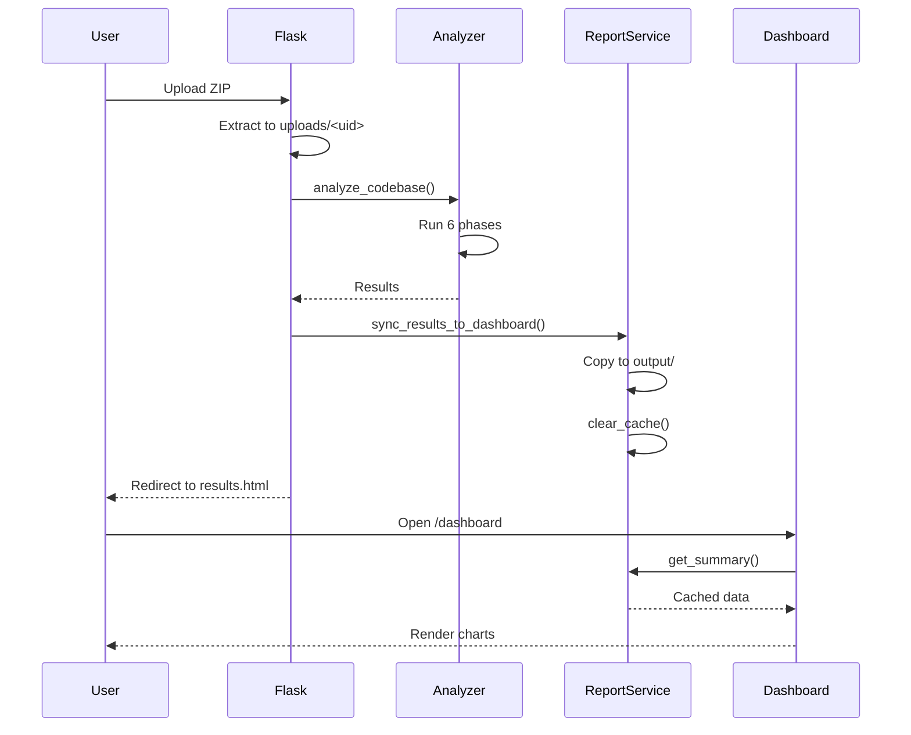
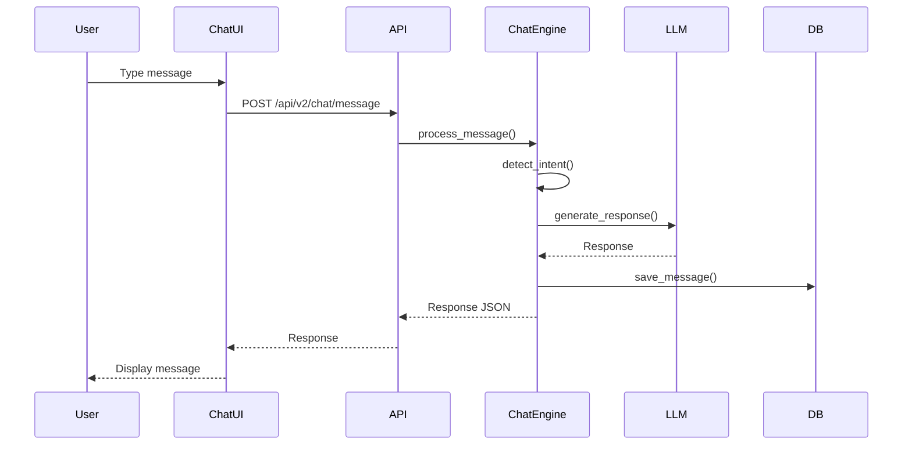

# AI-Powered Code Review Platform - Complete Architecture Documentation

## 🎯 Executive Summary

The **AI-Powered Code Review Platform** is a next-generation, enterprise-grade security analysis and code review system that combines traditional static analysis with cutting-edge AI technologies. It leverages multi-intelligence layers (static analyzers, embeddings, LLM agents, and meta-reasoning) to provide comprehensive, context-aware security vulnerability detection, code quality analysis, and automated remediation suggestions.

**Key Highlights:**

- 🔒 **Multi-Layer Security Analysis**: 6 integrated phases covering static analysis to interactive dashboards
- 🤖 **AI-Powered Insights**: LLM agents (OpenAI/Anthropic/Mistral) for intelligent code review
- 🔍 **RAG-Enhanced Search**: Hybrid retrieval with semantic embeddings and vector databases
- 📊 **Real-Time Dashboard**: Interactive security visualization with Chart.js
- 💬 **Conversational AI**: Chat interface with streaming responses
- 🎛️ **Highly Configurable**: Feature flags, multiple LLM providers, flexible deployment

---

## 📋 Table of Contents

1. [System Architecture](#system-architecture)
2. [Technology Stack](#technology-stack)
3. [Project Structure](#project-structure)
4. [Core Components](#core-components)
5. [Analysis Pipeline](#analysis-pipeline)
6. [Security Features](#security-features)
7. [API Architecture](#api-architecture)
8. [Data Flow](#data-flow)
9. [Configuration System](#configuration-system)
10. [Deployment Architecture](#deployment-architecture)
11. [Performance Optimization](#performance-optimization)
12. [Security Considerations](#security-considerations)

---

## 🏗️ System Architecture

### High-Level Architecture Diagram



### 6-Phase Integration Architecture



---

## 🛠️ Technology Stack

### Backend Framework

| Technology   | Version | Purpose        |
| ------------ | ------- | -------------- |
| **Python**   | 3.8+    | Core runtime   |
| **Flask**    | 3.0.0   | Web framework  |
| **Werkzeug** | 3.0.1   | WSGI utilities |

### Static Analysis Tools

| Tool        | Purpose                          | Language Support           |
| ----------- | -------------------------------- | -------------------------- |
| **Bandit**  | Security vulnerability detection | Python                     |
| **Semgrep** | Pattern-based code scanning      | Python, Java, JS, Go, etc. |
| **Ruff**    | Fast Python linter (Rust)        | Python                     |
| **Pylint**  | Code quality analysis            | Python                     |
| **Radon**   | Complexity metrics               | Python                     |

### AI/ML Stack

| Component            | Technology                               | Use Case                        |
| -------------------- | ---------------------------------------- | ------------------------------- |
| **LLM Providers**    | OpenAI GPT-4, Anthropic Claude, Mistral  | Security analysis, code review  |
| **Embeddings**       | OpenAI, Sentence-Transformers, Codestral | Semantic code understanding     |
| **Vector Databases** | Qdrant, FAISS                            | Similarity search, RAG          |
| **ML Frameworks**    | scikit-learn, XGBoost                    | Risk prediction (future)        |
| **DL Frameworks**    | PyTorch, Transformers                    | CodeBERT integration (optional) |

### Security & Vulnerability Detection

| Component                | Purpose                                     |
| ------------------------ | ------------------------------------------- |
| **detect-secrets**       | Hardcoded secrets detection                 |
| **OSV**                  | Open Source Vulnerabilities database        |
| **Custom OWASP Mapper**  | OWASP Top 10 2021 categorization            |
| **Dependency Analyzers** | Maven, Gradle, npm, Python package scanning |

### Frontend Technologies

| Technology             | Purpose                        |
| ---------------------- | ------------------------------ |
| **Vanilla JavaScript** | Interactive UI logic           |
| **Chart.js**           | Data visualization             |
| **Markdown-it**        | Markdown rendering             |
| **Highlight.js**       | Code syntax highlighting       |
| **CSS3**               | Modern styling with animations |

### Data Storage

| Type             | Technology                           |
| ---------------- | ------------------------------------ |
| **Vector Store** | Qdrant (primary), FAISS (fallback)   |
| **Chat History** | SQLite                               |
| **File Storage** | Local filesystem (uploads/processed) |
| **Report Cache** | In-memory (report_service)           |

---

## 📁 Project Structure

```
ai_code_review/
│
├── 📄 Core Application Files
│   ├── app.py                      # Flask web application (522 lines)
│   ├── main.py                     # CLI entry point
│   ├── cli.py                      # Command-line interface
│   ├── code_analysis.py            # Main analysis pipeline (619 lines)
│   ├── config.py                   # Configuration management (142 lines)
│   ├── setup.py                    # Package setup
│   └── requirements.txt            # Python dependencies
│
├── 🎨 Frontend (Web UI)
│   ├── templates/                  # HTML templates
│   │   ├── index.html              # Upload page (16KB)
│   │   ├── results.html            # Analysis results (13KB)
│   │   ├── dashboard.html          # Security dashboard (7KB)
│   │   ├── chat.html               # Chat interface (6KB)
│   │   ├── editor.html             # Code editor
│   │   └── processing.html         # Loading screen
│   │
│   └── static/                     # Static assets
│       ├── css/
│       │   ├── dashboard.css       # Dashboard styles
│       │   └── chat.css            # Chat styles
│       ├── js/
│       │   ├── dashboard.js        # Dashboard interactions
│       │   ├── chat.js             # Chat client with SSE
│       │   └── explorer.js         # File explorer
│       └── logo.png                # Platform logo
│
├── 🔍 Static Analysis Layer
│   └── static_analysis/
│       ├── ast_parser.py           # AST parsing & metrics
│       ├── multi_linter.py         # Multi-linter orchestrator
│       └── __init__.py
│
├── 🧠 AI/ML Intelligence Layer
│   ├── llm_agents/                 # LLM agent implementations
│   │   ├── base_agent.py           # Base LLM client (8KB)
│   │   ├── security_reviewer.py    # Security analysis agent
│   │   ├── refactor_agent.py       # Code refactoring agent
│   │   ├── chat_engine.py          # Conversational AI (12KB)
│   │   └── __init__.py
│   │
│   ├── embeddings/                 # Code embedding layer
│   │   ├── code_embedder.py        # Embedding generator
│   │   ├── vector_store.py         # FAISS vector store
│   │   ├── qdrant_store.py         # Qdrant integration
│   │   └── __init__.py
│   │
│   └── meta_reasoner/              # Meta-reasoning layer
│       ├── issue_aggregator.py     # Issue deduplication
│       ├── severity_ranker.py      # Risk scoring
│       ├── report_generator.py     # Comprehensive reporting
│       └── __init__.py
│
├── 🔐 Security Analysis Layer
│   └── security/
│       ├── cve_tracker.py          # CVE detection (16KB)
│       ├── dependency_analyzer.py   # Dependency scanning (21KB)
│       ├── owasp_mapper.py         # OWASP Top 10 mapping (21KB)
│       ├── secret_detector.py      # Secret scanning (8KB)
│       ├── security_aggregator.py  # Aggregation logic (13KB)
│       └── __init__.py
│
├── 🔎 Query & RAG System
│   └── query/
│       ├── query_handler.py        # Main query processor (7.7KB)
│       ├── retrieval_engine.py     # Hybrid retrieval
│       ├── rag_prompts.py          # RAG prompt templates
│       ├── pattern_filter.py       # Query pattern matching
│       └── __init__.py
│
├── 📊 Reporting Layer
│   └── reporting/
│       ├── security_report_generator.py  # Report generation
│       ├── fix_generator.py              # Fix suggestions
│       ├── dashboard_exporter.py         # Dashboard data export
│       └── __init__.py
│
├── 🔧 Services Layer
│   └── services/
│       ├── report_service.py       # Report caching & API (14KB)
│       ├── conversation_manager.py # Chat history (SQLite, 11KB)
│       ├── feedback_service.py     # User feedback (3KB)
│       ├── streaming_service.py    # SSE streaming (7KB)
│       └── __init__.py
│
├── 🗂️ Indexing & Parsing
│   ├── indexing/
│   │   └── code_indexer.py         # Code indexing for RAG
│   └── parsers/
│       ├── code_chunker.py         # Code segmentation
│       ├── java_parser.py          # Java AST parsing
│       └── __init__.py
│
├── 🌐 API Layer
│   └── api/
│       ├── v2_routes.py            # REST API v2 endpoints
│       └── __init__.py
│
├── 🧪 Testing
│   └── tests/
│       ├── test_chat_engine.py
│       ├── test_*.py               # Additional test files
│       └── fixtures/               # Test data
│
├── 💾 Data Storage (Runtime)
│   ├── uploads/                    # User-uploaded codebases
│   ├── processed/                  # Analysis results
│   ├── output/                     # Global output data
│   ├── vector_db/                  # Vector database files
│   ├── models/                     # ML model storage
│   └── feedback/                   # User feedback data
│
└── 📚 Documentation
    ├── README.md                   # User documentation
    ├── README_ARCHITECTURE.md      # This file
    ├── .env.example                # Configuration template
    └── docs/                       # Additional docs
```

---

## 🔧 Core Components

### 1. Web Application Layer (`app.py`)

**Flask Routes:**

| Route                        | Method   | Purpose                               |
| ---------------------------- | -------- | ------------------------------------- |
| `/`                          | GET/POST | Main upload page and analysis trigger |
| `/dashboard`                 | GET      | Security dashboard                    |
| `/chat`                      | GET      | Interactive chat interface            |
| `/api/analyze`               | POST     | Programmatic analysis API             |
| `/api/analyze/repo`          | POST     | GitHub repository analysis            |
| `/api/query`                 | POST     | Natural language security queries     |
| `/api/file/<uid>`            | GET      | Fetch file content                    |
| `/download/<uid>/<filename>` | GET      | Download reports                      |

**Dashboard API Endpoints (Phase 6):**

| Endpoint                     | Purpose                              |
| ---------------------------- | ------------------------------------ |
| `/api/security/summary`      | Executive security summary           |
| `/api/security/charts`       | Chart data (severity, OWASP, trends) |
| `/api/security/findings`     | Filterable findings with pagination  |
| `/api/security/finding/<id>` | Detailed finding information         |
| `/api/security/remediation`  | Prioritized remediation plan         |
| `/api/security/refresh`      | Trigger re-analysis                  |

**Chat API Endpoints (API v2):**

| Endpoint                         | Purpose                 |
| -------------------------------- | ----------------------- |
| `/api/v2/chat/message`           | Send chat message       |
| `/api/v2/chat/stream`            | SSE streaming endpoint  |
| `/api/v2/chat/conversations`     | List conversations      |
| `/api/v2/chat/conversation/<id>` | Get/delete conversation |

**Key Features:**

- File upload with ZIP extraction
- Repository cloning via Git
- Session-based analysis tracking
- Report synchronization to dashboard
- Error handling with custom error pages

---

### 2. Analysis Pipeline (`code_analysis.py`)

**CodeAnalyzer Class:**

```python
class CodeAnalyzer:
    def __init__(self):
        self.ast_parser = ASTParser()
        self.multi_linter = MultiLinter()
        self.embedder = CodeEmbedder()  # Optional
        self.security_agent = SecurityReviewer()  # Optional
        self.refactor_agent = RefactorAgent()  # Optional
```

**Analysis Workflow:**



**Processing Steps:**

1. **File Discovery**: Walk directory tree, filter by extension
2. **AST Analysis**: Extract complexity, LOC, method counts
3. **Code Formatting**: autopep8 with diff highlighting
4. **Static Analysis**: Run all enabled linters in parallel
5. **Dependency Scanning**: Detect package files, query OSV
6. **Secret Detection**: Regex-based pattern matching
7. **CVE Enrichment**: OWASP mapping and severity scoring
8. **LLM Analysis**: Chunked analysis for large files
9. **Report Generation**: JSON, Markdown, dashboard exports

---

### 3. LLM Agent Layer

#### **Base Agent** (`llm_agents/base_agent.py`)

**Supported Providers:**

- **OpenAI**: GPT-4, GPT-3.5, custom endpoints
- **Anthropic**: Claude 3 (Opus, Sonnet, Haiku)
- **Mistral**: Codestral, Mistral Large

**Key Methods:**

```python
class BaseLLMAgent:
    def generate(self, prompt: str, system_prompt: str = None) -> str
    def chat(self, messages: List[Dict]) -> str
    def stream_generate(self, prompt: str) -> Iterator[str]  # SSE support
```

#### **Security Reviewer** (`llm_agents/security_reviewer.py`)

**Analysis Focus:**

- SQL injection vulnerabilities
- XSS attack vectors
- Authentication/authorization flaws
- Cryptographic weaknesses
- Input validation issues

**Prompt Engineering:**

- Chain-of-thought reasoning
- Context injection (metrics, static issues)
- Structured output (JSON)

#### **Refactor Agent** (`llm_agents/refactor_agent.py`)

**Suggestions:**

- Code smell detection
- Design pattern recommendations
- Performance optimizations
- Code duplication reduction

#### **Chat Engine** (`llm_agents/chat_engine.py`)

**Features:**

- Multi-turn conversation support
- Intent detection (security vs. refactoring)
- Context-aware responses
- Persistent history (SQLite)
- Streaming responses (SSE)

**Intent Detection:**

```python
security_keywords = ['vulnerability', 'security', 'exploit', 'attack']
refactoring_keywords = ['refactor', 'improve', 'optimize', 'clean']
```

---

### 4. Security Intelligence Layer

#### **CVE Tracker** (`security/cve_tracker.py`)

**Integration:**

- OSV (Open Source Vulnerabilities) API
- Batch querying for efficiency
- Vulnerability object model

**Data Model:**

```python
class Vulnerability:
    id: str  # CVE-2023-12345
    package: str
    severity: str  # CRITICAL, HIGH, MEDIUM, LOW
    cvss_score: float
    description: str
    fixed_version: str
    references: List[str]
```

#### **Dependency Analyzer** (`security/dependency_analyzer.py`)

**Supported Ecosystems:**

| Language       | Package Files                                    |
| -------------- | ------------------------------------------------ |
| **Java**       | `pom.xml`, `build.gradle`, `build.gradle.kts`    |
| **JavaScript** | `package.json`, `package-lock.json`, `yarn.lock` |
| **Python**     | `requirements.txt`, `Pipfile`, `pyproject.toml`  |
| **Go**         | `go.mod`                                         |
| **Ruby**       | `Gemfile`                                        |

**Parsing Strategy:**

- XML parsing for Maven (pom.xml)
- Regex patterns for Gradle
- JSON parsing for npm/package.json
- Line-by-line for requirements.txt

#### **OWASP Mapper** (`security/owasp_mapper.py`)

**OWASP Top 10 2021 Mapping:**

```python
OWASP_CATEGORIES = {
    'A01:2021': 'Broken Access Control',
    'A02:2021': 'Cryptographic Failures',
    'A03:2021': 'Injection',
    'A04:2021': 'Insecure Design',
    'A05:2021': 'Security Misconfiguration',
    'A06:2021': 'Vulnerable and Outdated Components',
    'A07:2021': 'Identification and Authentication Failures',
    'A08:2021': 'Software and Data Integrity Failures',
    'A09:2021': 'Security Logging and Monitoring Failures',
    'A10:2021': 'Server-Side Request Forgery'
}
```

**CWE to OWASP Mapping:**

- CWE-79 (XSS) → A03:2021 (Injection)
- CWE-89 (SQLi) → A03:2021 (Injection)
- CWE-798 (Hardcoded Credentials) → A02:2021 (Cryptographic Failures)
- CWE-259 (Hard-coded Password) → A07:2021 (Auth Failures)

#### **Secret Detector** (`security/secret_detector.py`)

**Detection Patterns:**

- API keys (AWS, Google, Stripe, etc.)
- JWT tokens
- Database connection strings
- Private keys (RSA, PEM)
- Generic passwords

**Techniques:**

- Regex pattern matching
- Entropy analysis for random strings
- Context-aware false positive reduction

---

### 5. Query & RAG System

#### **Query Handler** (`query/query_handler.py`)

**Hybrid Retrieval Architecture:**



**Intent Categories:**

- `hardcoded_secrets`: Credential detection
- `sql_injection`: SQLi vulnerabilities
- `xss`: Cross-site scripting
- `cve`: Dependency vulnerabilities
- `pattern`: Security anti-patterns
- `location`: Code navigation
- `general`: Broad questions

**RAG Prompt Templates** (`query/rag_prompts.py`):

```python
class RAGPromptTemplates:
    @staticmethod
    def get_prompt_for_intent(intent, results, question, findings):
        # Intent-specific prompt engineering
        # Injects code chunks, security findings, context
```

**Dashboard Data Integration:**

- Injects latest security findings into RAG context
- Enriches answers with CVE data
- Cross-references code with known vulnerabilities

---

### 6. Reporting Layer

#### **Security Report Generator** (`reporting/security_report_generator.py`)

**Report Sections:**

1. **Executive Summary**: High-level metrics, risk score
2. **Findings Breakdown**: Severity distribution, OWASP categories
3. **Detailed Findings**: Per-finding analysis with remediation
4. **Dependency Vulnerabilities**: CVE list with CVSS scores
5. **Remediation Plan**: Prioritized action items with effort estimates

**Output Formats:**

- **JSON**: Machine-readable, dashboard consumption
- **Markdown**: Human-readable, documentation

#### **Fix Generator** (`reporting/fix_generator.py`)

**Fix Suggestion Types:**

- Code patches (before/after)
- Configuration changes
- Dependency upgrades
- Architectural recommendations

**Generation Strategy:**

- Template-based for common patterns
- LLM-powered for complex issues
- Language-specific best practices

#### **Dashboard Exporter** (`reporting/dashboard_exporter.py`)

**Exported Data:**

```json
{
  "summary": {
    "total_findings": 42,
    "critical": 5,
    "high": 15,
    "risk_score": 78.5
  },
  "charts": {
    "severity_distribution": {...},
    "owasp_coverage": {...},
    "vulnerability_trends": {...}
  },
  "findings": [...],
  "remediation_plan": [...]
}
```

---

### 7. Service Layer

#### **Report Service** (`services/report_service.py`)

**Responsibilities:**

- Report caching (in-memory)
- Dashboard data aggregation
- Findings filtering and pagination
- Summary statistics calculation

**Caching Strategy:**

```python
class ReportService:
    def __init__(self):
        self._cache = {}  # In-memory cache
        self._cache_timestamp = None

    def get_summary(self):
        if self._is_cache_stale():
            self.reload_report()
        return self._cache['summary']
```

#### **Conversation Manager** (`services/conversation_manager.py`)

**SQLite Schema:**

```sql
CREATE TABLE conversations (
    id TEXT PRIMARY KEY,
    created_at TIMESTAMP,
    updated_at TIMESTAMP
);

CREATE TABLE messages (
    id INTEGER PRIMARY KEY AUTOINCREMENT,
    conversation_id TEXT,
    role TEXT,  -- 'user' or 'assistant'
    content TEXT,
    timestamp TIMESTAMP,
    FOREIGN KEY (conversation_id) REFERENCES conversations(id)
);
```

**Features:**

- Conversation persistence
- Message history retrieval
- Context window management
- Export to Markdown/JSON

#### **Streaming Service** (`services/streaming_service.py`)

**SSE Implementation:**

```python
def stream_chat_response(message, conversation_id):
    for chunk in llm_agent.stream_generate(prompt):
        yield f"data: {json.dumps({'chunk': chunk})}\n\n"
    yield f"data: {json.dumps({'done': true})}\n\n"
```

**Client-Side:**

```javascript
const eventSource = new EventSource("/api/v2/chat/stream");
eventSource.onmessage = (event) => {
  const data = JSON.parse(event.data);
  // Append chunk to UI
};
```

---

## 🔄 Analysis Pipeline

### Complete Analysis Flow



---

## 🔐 Security Features

### Multi-Layer Security Detection

| Layer                   | Detection Method     | Examples                            |
| ----------------------- | -------------------- | ----------------------------------- |
| **Static Analysis**     | Linter rules         | SQL injection, XSS, buffer overflow |
| **Pattern Matching**    | Regex, Semgrep rules | Hardcoded secrets, insecure crypto  |
| **Dependency Scanning** | OSV CVE database     | Known vulnerabilities in packages   |
| **LLM Analysis**        | Contextual reasoning | Business logic flaws, design issues |
| **Secret Detection**    | Entropy + patterns   | API keys, passwords, tokens         |

### OWASP Top 10 2021 Coverage

**A01: Broken Access Control**

- Authorization bypass detection
- Path traversal vulnerabilities

**A02: Cryptographic Failures**

- Hardcoded secrets
- Weak encryption algorithms (MD5, SHA1)
- Plaintext storage

**A03: Injection**

- SQL injection (SQLi)
- Command injection
- Cross-site scripting (XSS)

**A04: Insecure Design**

- Architecture anti-patterns (LLM-detected)
- Missing security controls

**A05: Security Misconfiguration**

- Debug mode in production
- Default credentials
- Exposed sensitive endpoints

**A06: Vulnerable and Outdated Components**

- CVE detection in dependencies
- Outdated package versions

**A07: Authentication Failures**

- Weak password policies
- Session management issues

**A08: Software and Data Integrity Failures**

- Insecure deserialization
- Unsigned code execution

**A09: Logging and Monitoring Failures**

- Missing error logging
- Insufficient audit trails

**A10: SSRF**

- Unvalidated URL redirects

---

## 🌐 API Architecture

### REST API v2 Endpoints

**Base Path:** `/api/v2`

#### Chat Endpoints

```
POST   /api/v2/chat/message
GET    /api/v2/chat/stream
GET    /api/v2/chat/conversations
GET    /api/v2/chat/conversation/<id>
DELETE /api/v2/chat/conversation/<id>
POST   /api/v2/chat/export
```

#### Analysis Endpoints

```
POST   /api/analyze              # Upload and analyze
POST   /api/analyze/repo         # Clone and analyze GitHub repo
GET    /api/file/<uid>           # Get file content
POST   /api/query                # Natural language query
```

#### Dashboard Endpoints

```
GET    /api/security/summary
GET    /api/security/charts
GET    /api/security/findings
GET    /api/security/finding/<id>
GET    /api/security/remediation
GET    /api/security/refresh
POST   /api/feedback
```

### Request/Response Formats

**Analysis Request:**

```json
{
  "repo_url": "https://github.com/user/repo",
  "branch": "main"
}
```

**Analysis Response:**

```json
{
  "uid": "abc-123",
  "summary": {
    "files_analyzed": 42,
    "security_issues": 15,
    "cve_vulnerabilities": 7
  },
  "download_url": "/download/abc-123/security_report.json"
}
```

**Query Request:**

```json
{
  "question": "Are there any hardcoded API keys?",
  "max_results": 5
}
```

**Query Response:**

```json
{
  "question": "...",
  "answer": "Yes, found 3 hardcoded API keys...",
  "sources": [
    {
      "file": "config.py",
      "lines": "15-20",
      "score": 0.95
    }
  ],
  "intent": "hardcoded_secrets"
}
```

---

## 📊 Data Flow

### Upload to Dashboard Flow



### Chat Interaction Flow



---

## ⚙️ Configuration System

### Environment Variables (`.env`)

**LLM Configuration:**

```bash
LLM_PROVIDER=openai          # openai, anthropic, mistral
LLM_MODEL=gpt-4-turbo-preview
OPENAI_API_KEY=sk-...
LLM_TEMPERATURE=0.2
LLM_MAX_TOKENS=2000
```

**Embedding Configuration:**

```bash
EMBEDDING_PROVIDER=local     # local, openai, codestral
OPENAI_EMBEDDING_MODEL=text-embedding-3-small
LOCAL_EMBEDDING_MODEL=all-MiniLM-L6-v2
```

**Vector Database:**

```bash
VECTOR_DB_TYPE=qdrant        # qdrant, faiss
QDRANT_HOST=localhost
QDRANT_PORT=6333
QDRANT_USE_MEMORY=true       # In-memory for dev
```

**Feature Flags:**

```bash
ENABLE_BANDIT=true
ENABLE_SEMGREP=true
ENABLE_RUFF=true
ENABLE_PYLINT=false          # CPU-intensive
ENABLE_LLM_AGENTS=true
ENABLE_SEMANTIC_SEARCH=true
ENABLE_CVE_DETECTION=true
ENABLE_SECURITY_REPORTING=true
ENABLE_STREAMING=true
```

**Performance:**

```bash
MAX_WORKERS=4
CACHE_EMBEDDINGS=true
QUERY_MAX_RESULTS=10
CHUNK_STRATEGY=function      # function, class, file
```

### Configuration Hierarchy

```
1. Environment Variables (.env)
   ↓
2. config.py (Default Values)
   ↓
3. Runtime Overrides (Command-line args)
```

---

## 🚀 Deployment Architecture

### Local Development

```bash
# 1. Install dependencies
pip install -r requirements.txt

# 2. Start Qdrant (optional)
docker run -p 6333:6333 qdrant/qdrant

# 3. Run Flask app
python app.py

# Opens on http://localhost:5000
```

### Production Deployment

**Option 1: Gunicorn (Recommended)**

```bash
gunicorn -w 4 -b 0.0.0.0:8000 app:app --timeout 300
```

**Option 2: Docker**

```dockerfile
FROM python:3.9-slim

WORKDIR /app
COPY requirements.txt .
RUN pip install -r requirements.txt

COPY . .

EXPOSE 5000
CMD ["gunicorn", "-w", "4", "-b", "0.0.0.0:5000", "app:app"]
```

**Option 3: Cloud Platforms**

- **Heroku**: `Procfile` with `web: gunicorn app:app`
- **AWS ECS**: Docker container deployment
- **Google Cloud Run**: Containerized deployment

### Scalability Considerations

**Horizontal Scaling:**

- Stateless Flask app (session data in cookies/DB)
- Shared vector database (Qdrant cluster)
- Distributed cache (Redis)

**Vertical Scaling:**

- Increase worker count
- Larger instance for LLM inference
- GPU instances for deep learning (optional)

**Background Processing:**

- Celery for long-running analyses
- Redis as message broker

---

## ⚡ Performance Optimization

### Caching Strategy

| Layer             | Cache Type       | TTL           |
| ----------------- | ---------------- | ------------- |
| **Embeddings**    | File system      | Permanent     |
| **Reports**       | In-memory        | Until refresh |
| **LLM Responses** | None (stateless) | -             |
| **CVE Data**      | File system      | 24 hours      |
| **Vector Store**  | Persistent       | Permanent     |

### Optimization Techniques

**1. Code Chunking:**

- Large files analyzed in sections
- Top 5 critical sections prioritized

**2. Parallel Processing:**

- Multi-linter runs concurrently (`ThreadPoolExecutor`)
- Dependency scanning parallelized

**3. Batch Requests:**

- CVE queries batched (OSV API)
- Embedding generation batched

**4. Lazy Loading:**

- LLM agents initialized on-demand
- Vector store loaded per-analysis

**5. Result Caching:**

- Dashboard data cached until refresh
- Conversation history paginated

### Expected Performance

| Metric     | Small Repo       | Medium Repo        | Large Repo           |
| ---------- | ---------------- | ------------------ | -------------------- |
| **Size**   | 10 files, 1K LOC | 100 files, 10K LOC | 1000 files, 100K LOC |
| **Time**   | <30s             | <3 min             | <15 min              |
| **Memory** | ~500 MB          | ~1.5 GB            | ~4 GB                |

---

## 🔒 Security Considerations

### Platform Security

**Input Validation:**

- File upload size limits (50 MB)
- ZIP bomb protection
- Path traversal prevention

**Authentication:**

- No authentication (localhost-only by default)
- Add OAuth/JWT for production

**API Security:**

- Rate limiting (recommended for production)
- CORS configuration
- API key rotation

**Data Privacy:**

- Code stored temporarily
- No external data transmission (except LLM APIs)
- User feedback anonymized

### Secure Development Practices

**Secret Management:**

- Environment variables for API keys
- `.env` excluded from Git
- Rotate keys regularly

**Dependency Security:**

- Regular `pip audit`
- Dependabot alerts
- Pin versions in `requirements.txt`

**Code Review:**

- Self-analysis capability
- Automated linting in CI/CD

---

## 📈 Future Enhancements

### Planned Features

- [ ] **ML Risk Prediction**: Train custom models on vulnerability data
- [ ] **GitHub Integration**: PR review bot, webhook support
- [ ] **IDE Plugins**: VSCode/IntelliJ extensions
- [ ] **CI/CD Integration**: Jenkins, GitLab CI, GitHub Actions plugins
- [ ] **Multi-Language Expansion**: Better support for Go, Rust, C++
- [ ] **GraphCodeBERT**: Advanced code understanding
- [ ] **Automated Patching**: Auto-generate and apply fixes
- [ ] **Team Collaboration**: User roles, shared reports
- [ ] **Compliance Reports**: SOC 2, HIPAA, GDPR checklists
- [ ] **API Gateway**: Rate limiting, authentication layer

### Research Directions

- **Fine-tuned LLMs**: Domain-specific models for security
- **Graph Neural Networks**: Code structure analysis
- **Federated Learning**: Privacy-preserving model training
- **Explainable AI**: Interpretable vulnerability predictions

---

## 🏁 Conclusion

The **AI-Powered Code Review Platform** represents a state-of-the-art fusion of traditional static analysis and modern AI technologies. Its modular, extensible architecture allows for continuous enhancement while maintaining stability and performance.

**Key Strengths:**
✅ 6-phase integrated pipeline
✅ Multi-LLM provider support
✅ RAG-enhanced intelligent querying
✅ Real-time interactive dashboard
✅ Comprehensive security coverage
✅ Production-ready architecture

**Use Cases:**

- 🏢 Enterprise security audits
- 🎓 Educational code review
- 🔬 Research in AI-assisted security
- 🚀 Startup risk assessment
- 🛡️ Open-source project scanning

---

## 📞 Support & Contact

- **Documentation**: See `README.md` for user guide
- **Issues**: GitHub Issues (if repository is public)
- **Contributing**: See `CONTRIBUTING.md` (if available)

---

**Last Updated:** January 2026  
**Version:** 1.0 (6 Phases Complete)  
**Maintained By:** Krushna56/ai_code_review
